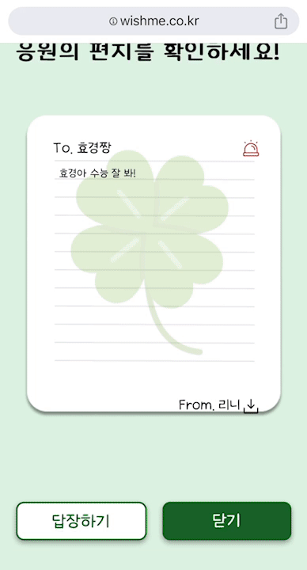

# Wish Me (나의 행운을 빌어줘)

## 프로젝트 개요

2023.10.09 ~ 2023.11.17

## 목차

1. [프로젝트 기획 배경](#프로젝트-기획-배경)
2. [프로젝트 목표](#프로젝트-목표)
3. [성과](#성과)
4. [주요기능](#주요기능)
5. [서비스 화면](#서비스-화면)
6. [기술차별점](#기술차별점)
7. [확장가능성](#확장가능성)
8. [홍보](#홍보)
9. [개발환경](#개발환경)
10. [프로젝트 구조](#프로젝트-구조)
11. [서비스 아키텍쳐](#서비스-아키텍쳐)
12. [협업환경](#협업-환경)
13. [팀원](#팀원)
14. [프로젝트 산출물](#프로젝트-산출물)
15. [프로젝트 발표자료](#프로젝트-발표자료)

## 프로젝트 기획 배경

기획 배경~~

## 프로젝트 목표

프로젝트 목표~~

## 성과

성과~~

## 주요기능

**개인 편지 보내기**

- 공유받은 URL로 책상에 접속하여 책상위에 올릴 선물을 선택하고, 응원의 편지를 작성할 수 있습니다. 
- 공개 여부를 선택할 수 있으며, 비공개인 경우 책상의 주인만 확인할 수 있습니다. 모든 편지는 암호화되어 저장됩니다.

**책상 공유하기**

- 자신만의 책상을 카카오톡/링크 공유를 통해 URL로 전달할 수 있습니다.
- 책상은 URL을 통해 접속한 사람만이 볼 수 있는 공간으로 책상위에 선물을 통해 편지를 확인하고 작성할 수 있습니다. 

**편지 필터링**

- 편지 작성을 완료한 후에 chatgpt를 이용하여 편지 내용을 필터링 합니다. 
- 욕설은 하트로 변환이 되고, 부정적인 표현이 감지되면 편지 확인 시에 모달을 통해 알림을 줍니다.

**답장**
- 책상의 주인은 응원의 편지에 답장을 작성할 수 있습니다. 
- 편지의 작성자는 답장함을 통해 답장과 작성한 편지를 확인할 수 있습니다. 

**학교 편지 보내기**

- 학교 검색 또는 공유받은 학교 URL을 통해 학교 칠판에 접속할 수 있습니다.
- 칠판에 문구를 선택하여 응원의 편지를 확인할 수 있습니다.
- 칠한에 올릴 문구를 선택하고, 응원의 메시지를 작성하여 게시할 수 있습니다.

**신고하기**
- 비방·비하·욕설 편지를 신고할 수 있습니다.

**다운로드**
- 간직하길 원하는 편지를 다운로드 할 수 있습니다.

**마이페이지**
- 개인 책상에 남겨지는 닉넥임을 수정할 수 있고, 학교를 지정하여 저장할 수 있습니다.

**버그 신고하기**
- 개발자 책상을 이용하여 편지를 남기거나, 버그 신고하기 메뉴를 통해 오류를 신고할 수 있습니다.

## 서비스 화면

### 개인 책상 

**개인 책상 접속**

- `카카오톡으로 로그인` 버튼을 누르면 로그인 후 `개인 책상`으로 이동합니다.
- 처음 회원가입한 회원이라면 빈 책상이 생성됩니다.

**개인 책상 공유**

- `내 책상 공유하기` 버튼을 누르면 공유 방법을 선택할 수 있습니다.
- `카카오톡 공유하기` , `링크 공유하기`를 통해 자신만의 책상을 공유할 수 있습니다. 책상은 URL을 통해 접속한 사람만이 확인 가능합니다.

**개인편지 작성**

- 공유받은 URL을 통해 친구의 책상에 접속할 수 있습니다. `응원하기` 버튼을 통해 응원의 편지를 남길 수 있습니다.
- 응원의 편지를 답장을 받기를 원하다면 로그인이 필요합니다.
- 책상 위에 올려놓을 선물을 선택하고 응원의 편지를 작성할 수 있습니다. 공개여부를 선택할 수 있습니다.

**개인 편지 확인**

- 책상에 응원의 선물을 선택하여 편지를 확인할 수 있습니다. 
- 간직하고 싶은 편지라면 `다운로드`하여 소장할 수 있습니다.
- 부정적인 내용이 담긴 편지라면 열럼 여부를 미리 확인하고 있습니다. `신고` 버튼을 통해 부정적인 편지를 신고하여 책상에서 삭제할 수 있습니다. 

**답장 작성**

- 편지 확인 화면에서 `답장하기` 버튼을 통해 답장을 작성할 수 있습니다. 답장 편지의 색상을 선택 후 응원의 답장을 남길 수 있습니다.

**답장 확인**

- 메뉴바의 `답장함 가기`를 통해 받은 답장 목록을 확인할 수 있습니다.
- 하트 답장을 누르면 받은 답장을 확인할 수 있고, `내 책상 공유하기` 버튼을 누르면 내가 작성한 응원의 편지도 확인할 수 있습니다.

### 학교 칠판

**학교 칠찬 접속**

- 홈화면의 `로그인하지 않고 학교 응원 구경하기` 또는 메뉴바의 `학교 칠판 구경하기`를 통해 학교 검색 화면을 접속할 수 있습니다.
- 학교명의 검색을 통해 `학교 칠판`으로 접속할 있습니다.

**학교 편지 작성**

- `응원 하기`버튼을 통해 응원의 편지를 남갈 수  있습니다. 학교 칠판에 올라갈 응원의 문구를 선택하고 닉네임과 함께 응원의 편지를 작성할 수 있습니다.
- 학교 편지는 모두에게 공개되는 편지입니다. 부적절한 글에는 신고가 가능합니다.

### 메뉴바

**마이페이지**

- 메뉴바의 `마이페이지`로 이동하면 닉네임과 학교를 수정할 수 있습니다. 학교를 변경하면, 내 책상에서도 학교로 바로 이동할 수 있습니다.

**개발자 편지**

- 메뉴바의 `개발자 책상 가기`로 이동하면 개발자에게 문의하거나 편지를 작성할 수 있습니다. 

## 기술차별점

기술차별점~~

### 확장가능성

확장가능성~~

## 홍보

홍보~~

## 개발환경

개발환경~~

## 프로젝트 구조

프로젝트 구조~~

## 와이어프레임

사진~~

## ERD

사진~~

## 서비스 아키텍쳐

사진~~

## 협업 환경

협업 환경~~

## 팀원

|                                                                    [김은서](https://github.com/EunSeo119)                                                                    |                        [이효경](https://github.com/EunSeo119)                         |                           [조해린](https://github.com/EunSeo119)                           |                           [최준서](https://github.com/EunSeo119)                            |                        [허다은](https://github.com/EunSeo119)                         |                        
| :-----------------------------------------------------------------------------------------------------------------------------------------------------------------------: | :---------------------------------------------------------------------------------------: | :---------------------------------------------------------------------------------------: | :---------------------------------------------------------------------------------------: | :---------------------------------------------------------------------------------------: | 
|  |  |  |  |  |
|                                                                               **Full-Stack**                                                                                |                                        **Full-Stack**                                        |                                        **Full-Stack**                                        |                                       **Infra**                                        |                                      **Infra**                                       |                                       

## 프로젝트 산출물

프로젝트 산출물~~

## 프로젝트 발표자료

발표자료~~

