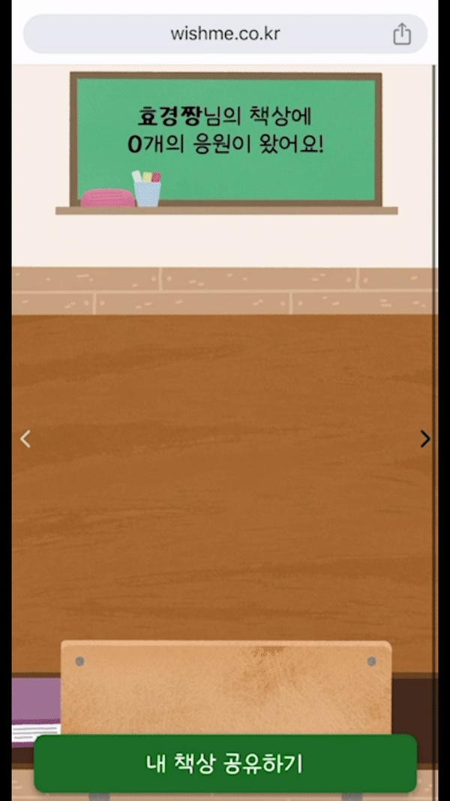
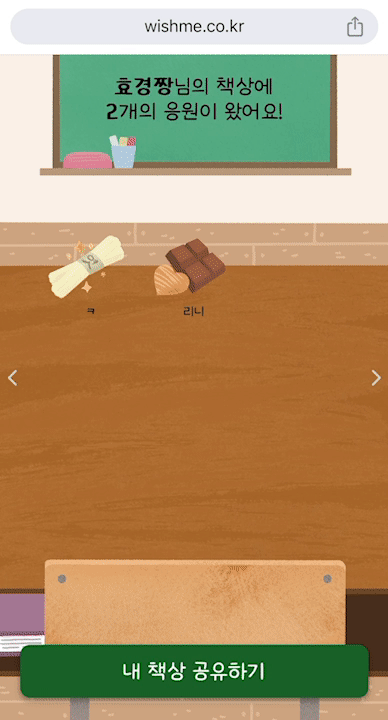

# 시연시나리오

## 1. 책상만들기

| 1-1. 나만의 책상 생성하기 | 1-2. 내 책상 공유하기 |
| :------: | ------------------------------------ |
|  |  |

로그인을 하면 나만의 책상이 생성됩니다.

공유하기 버튼을 누르면 카카오톡으로 공유할 수 있고, 내 책상에 편지를 남길 수 있어요.

## 2. 편지 작성하기

| 2-1. 공유받은 책상 접속하기 | 2-2. 편지 작성하기 |
| :------: | ------------------------------------ |
|  |  |

공유 받은 주소로 접속하면 편지를 작성할 수 있습니다.

편지의 답장을 받기 위해서는 우선 로그인이 필요합니다.  그리고 편지의 선물을 선택하고, 응원의 말을 남겨주세요.

## 3. 내 책상 확인하기

| 3-1 편지 확인 / 답장 보내기 | 3-2 부정 편지 확인 / 신고하기 |
| :------: | ------------------------------------ |
|  |  |

로그인을 통해 내 책상에 접속하면 책상에 올려진 선물들을 통해 편지를 확인할 수 있습니다. 

선물을 누르면 응원의 편지를 확인할 수 있고, 편지를 다운로드 받을 수 있습니다. 응원에 보답하고 싶다면 답장 버튼을 통해 답장을 작성할 수 있습니다.

만약 부정적인 편지를 받게 된다면 먼저 팝업을 통해 먼저 열람할지 확인합니다.  예를 누르면 편지를 확인할 수 있고 신고 버튼을 통해  직접 신고할 수 있어요, 신고한 편지는 목록에서 사라집니다.

 

## 4. 답장함

| 4-1. 답장 확인하기 |
| :------: |
|  |

메뉴바에서 답장함을 누르면 나에게 온 답장을 확인할 수 있어요! 답장을 작성한 편지가 궁금하다면 내 편지 보기를 눌러서 확인할 수 있어요

## 5. 학교 편지 확인하기

| 5-1. 학교 칠판 접속하기 | 5-2. 학교 칠판 편지 작성하기 |
| :------: | ------------------------------------ |
|  |  |

학교를 검색하여 학교의 칠판으로 이동할 수 있습니다.  학교 칠판에 적혀진 문구를 누르면 편지를 확인할 수 있어요,  아래 응원하기를 통해 편지를 작성할 수 있어요, 칠판의 남길 문구를 선택하고 응원의 글을 작성해주세요, 칠판에 응원이 남겨졌어요!

학교 공유하기 버튼을 통해 카카오톡이나 링크를 통해 간편하게 학교 칠판을 공유할 수 있어요

나도 응원 받기를 통해 내 책상으로 이동할 수 있습니다.

## 6. 그 밖에 기능

| 6-1. 마이페이지 | 6-2. 개발자 책상가기 |
| :------: | ------------------------------------ |
|  |  |

메뉴 바의 마이페이지를 통해 닉네임과 학교를 변경할 수 있습니다. 닉네임을 변경하면 내 책상의 이름이 변경됩니다.

‘개발자 책상가기’를 통해 개발자에게 응원이나 문의를 남길 수 있습니다.
